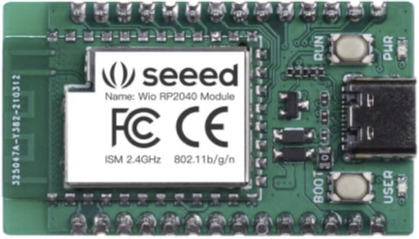

===============================
Seeed Wio RP2040 mini
===============================

The Seeed Wio RP2040 mini <https://www.seeedstudio.com/Wio-RP2040-mini-Dev-Board-p-4933.html>
is a general purpose RP2040 board with an integrated ESP8285 to allow wireless communication.

Features
========

* RP2040 microcontroller chip
* Dual-core ARM Cortex M0+ processor, flexible clock running up to 133 MHz
* 264kB of SRAM, and 2MB of on-board Flash memory
* Castellated module allows soldering direct to carrier boards
* USB 1.1 Host and Device support
* Low-power sleep and dormant modes
* Drag & drop programming using mass storage over USB
* 26 multi-function GPIO pins
* 2× SPI, 2× I2C, 2× UART, 3× 12-bit ADC, 16× controllable PWM channels
* Accurate clock and timer on-chip
* Temperature sensor
* Accelerated floating point libraries on-chip
* 8 × Programmable IO (PIO) state machines for custom peripheral support

Serial Console
==============

By default a serial console appears on pins 1 (TX GPIO0) and pin 2
(RX GPIO1).  This console runs a 115200-8N1.

The board can be configured to use the USB connection as the serial console.

Buttons and LEDs
================

User LED controlled by GPIO13.

A BOOTSEL button, which if held down when power is first
applied to the board, the cause the RP2040 to boot programming mode 
and appear to a computer connected via USB as a storage device.  
Saving a .UF2 file to this device will replace the Flash ROM contents 
on the RP2040.

A RESET button the reboots the RP2040 without disconnecting the
power supply.

Pad Mapping
===========
Pads are numbered anticlockwise from the USB connector.

===== ========== ==========
Pad   Signal     Notes
===== ========== ==========
1     GPIO0      Default TX for UART0 serial console
2     GPIO1      Default RX for UART1 serial console
3     Ground
4     GPIO2
5     GPIO3
6     GPIO4
7     GPIO5
8     GPIO6
9     GPIO7
10    GPIO12
11    GPIO13    also LED
12    Ground
13    GPIO14
14    GPIO15
15    SWCLK     Serial Debug Port
16    SWDIO     Serial Debug Port
17    Ground
18    GPIO16
19    GPIO17
20    GPIO18
21    GPIO19
22    GPIO26     ADC0
23    GPIO27     ADC1
24    GPIO28     ADC2
25    GPIO29     ADC3
26    Ground
27    3V3        Power output to peripherals
28    VIN        +5V Supply to board
===== ========== ==========

The following gpio pads are used internally to the wio rp2040.

========== ==========
Signal     Notes
========== ==========
GPIO8      spi1 rx
GPIO9      spi1 csn
GPIO10     spi1 sck
GPIO11     spi1 rx
GPIO20     i2c0 sda
GPIO21     i2c0 scl
GPIO22     
GPIO23     
GPIO24     
GPIO25     
========== ==========

Power Supply 
============

The Wio RP2040 mini can be powered via the USB connector,
or by supplying +5V to pin 28.

The Raspberry Pi Pico chip run on 3.3 volts.  This is supplied
by an onboard voltage regulator. 

Configurations
==============

audiopack
---------

NuttShell configuration (console enabled in UART0, at 115200 bps) with
support for NSPlayer audio player.

composite
---------

NuttShell configuration (console enabled in UART0, at 115200 bps) with support for
CDC/ACM with MSC USB composite driver.

displaypack
-----------

NuttShell configuration (console enabled in USB Port, at 115200 bps) supporting
ST7789 video display.

enc28j60
--------

NuttShell configuration (console enabled in UART0, at 115200 bps) with support for
NC28J60.

lcd1602
-------

NuttShell configuration (console enabled in UART0, at 115200 bps) with support for
LCD1602.

nsh
---

Basic NuttShell configuration (console enabled in UART0, at 115200 bps).

nshsram
-------

NuttShell configuration (console enabled in UART0, at 115200 bps) with interrupt
vectors in RAM.

smp
---

Basic NuttShell configuration (console enabled in UART0, at 115200 bps) with
both ARM cores enabled.

spisd
-----

NuttShell configuration (console enabled in UART0, at 115200 bps) with SPI configured.

ssd1306
-------

NuttShell configuration (console enabled in UART0, at 115200 bps) with support for
ssd1306.

st7735
------

NuttShell configuration (console enabled in UART0, at 115200 bps) with support for
st7735.

usbmsc
------

NuttShell configuration (console enabled in UART0, at 115200 bps) with support for
usbmsc.

usbnsh
------

Basic NuttShell configuration (console enabled in USB Port, at 115200 bps).

waveshare-lcd-1.14
------------------

NuttShell configuration (console enabled in UART0, at 115200 bps) with support for
st7789.

waveshare-lcd-1.3
-----------------

NuttShell configuration (console enabled in UART0, at 115200 bps) with support for
usbmsc.

